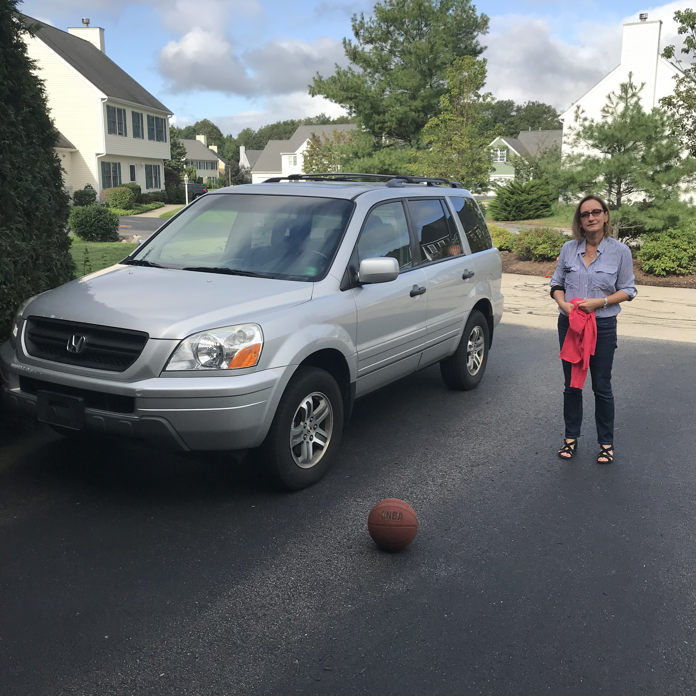
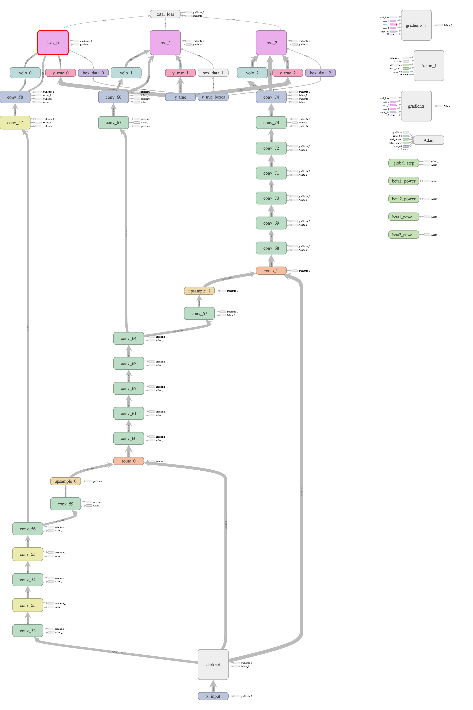

# tensorflow_yolov3
A well-documented TensorFlow implementation of the YOLOv3 model.

Introduction
============
This is a TensorFlow implementation of the YOLOv3 model as described in [this paper](https://pjreddie.com/media/files/papers/YOLOv3.pdf) by Joseph Redmon.
It is meant to be the best available online learning resource for understanding how to recreate the model's complex architecture from scratch.
All code in the repository is fully documented. Sample TensorBoard event files have also been included to help with visualizing the graph structure and the loss during training. 

The resources used in the making of this project were:
- http://machinethink.net/blog/object-detection/ This blog post provides an incredibly good theoretical overview of how these types of object detection models work. It is highly recommended to read the entire post.
- https://towardsdatascience.com/yolo-v3-object-detection-53fb7d3bfe6b Another blog post diving into theory.
- https://itnext.io/implementing-yolo-v3-in-tensorflow-tf-slim-c3c55ff59dbe A guide with code that gives a breakdown of all the different types of layers found in YOLOv3.
- https://blog.paperspace.com/how-to-implement-a-yolo-v3-object-detector-from-scratch-in-pytorch-part-3/ A PyTorch implementation of the YOLOv3 model. Contains a useful graphic for understanding how Caffe saves model weights and how to read them for conversion into PyTorch/TensorFlow formats.
- https://github.com/qqwweee/keras-yolo3 A repository that contains a Keras implementation (using TensorFlow as a backend) of the YOLOv3 model. The code is very difficult to follow. This project's implementation of the loss function and training configuration is based off of this repository.
- https://github.com/pjreddie/darknet/blob/master/cfg/yolov3.cfg The original author's configuration of the YOLOv3 architecture. The author uses Caffe as his deep learning framework. 
https://pjreddie.com/media/files/papers/YOLOv3.pdf The original author's paper. Helpful in understanding the loss function.

Quick Start
===========
Dependencies
------------
The test environment is
- Python 3.6.3
- tensorflow 1.10.1
- numpy 1.14.5
- cv2 3.4.0
Please make sure to have all of these dependencies installed before using.
Follow these links if you are struggling with installing these dependencies:
https://www.python.org/downloads/
https://pip.pypa.io/en/stable/installing/ 
https://www.tensorflow.org/install/
https://www.scipy.org/install.html
https://pypi.org/project/opencv-python/

Setup
-----
1. Open up terminal and cd into the root directory of this repository.
2. Enter `model_weights/get_pretrained_coco_weights.sh` into the terminal, which will download the weights pretrained on the COCO dataset for use with YOLOv3. Alternatively if you are not using a MacBook, you can download the weights manually from [this link](https://www.dropbox.com/s/hgi354dajhc9yso/coco_pretrained_weights.zip), unzip them, and place them in the 'model_weights' directory. Make sure that the 'model_weights' directory looks like this:
.
+-- _model_weights
|   +-- coco_pretrained_weights.ckpt.data-00000-of-00001
|   +-- coco_pretrained_weights.ckpt.index
|   +-- coco_pretrained_weights.ckpt.meta
|   +-- get_pretrained_coco_weights.sh

With the pretrained weights downloaded, `detect.py` and `train.py` are now ready to use.

Perform Object Detection on an Image Using 'detect.py'
======================================================
`detect.py` feeds an image into the YOLOv3 model and saves a new image with the detected objects.
For example, with this image as the input:

The resulting output will be this image:

Usage
-----
To perform object detection on an image, follow these steps:

1. With your open terminal cd to the repository's root directory.
2. Enter `python detect.py --path_to_input_image=path/to/your/image.jpg` into the terminal. You can also identically recreate the example output by typing in `python detect.py --path_to_input_image=training_data/images/img1.jpg` to get a better feeling for how the program works.

It's as simple as that. Typing in `python detect.py --help` will give you a full rundown of the options available to you, of which include being able to load a different set of pretrained weights and changing the save name of the output image.

Train the YOLOv3 Model on a New Dataset Using 'train.py'
========================================================
`train.py` trains the YOLOv3 model on a custom dataset. This means that YOLOv3 can be trained to identify almost any kind of object as long as the right dataset is provided. 

To begin training on a custom dataset, follow these steps:
1. With your open terminal cd to the repository's root directory.
2. Make sure that the `training_data` directory is updated to include your dataset. Consult the current example setup to see how the dataset should be stored and prepared.
3. Enter `python train.py --train_from_chekpoint=model_weights/coco_pretrained_weights.ckpt` into the terminal to begin training the model from the pretrained coco weights (recommended). You can also simply enter `python train.py` to train the model from scratch with randomly initialized weights (not recommended). 

Typing in `python train.py --help` will give a full rundown of the options available to you. Some of the most important options include controlling how frequently the training model logs its loss and saves its weights, whether or not you want to purposefully overfit the model onto a single image for debugging purposes, adjusting the learning rate, adjusting the number of training epochs, and adjusting the split ratio between training data and validation data.

Inspect the YOLOv3 Model Architecture with TensorBoard
======================================================
TensorBoard is a powerful tool for visualizing machine learning models. Everytime `detect.py` or `train.py` is run, TensorBoard event files will be saved with the latest graph data. 

To access the event file generated during dectection, follow these steps:
1. With your open terminal cd to the repository's root directory.
2. Enter `tensorboard --logdir=tensorboard/tensorboard_detect/` into the terminal.
3. When a popup displaying the warning: "Do you want the application “python3.6” to accept incoming network connections?" shows up, click "accept".
4. Open up a web browser and copy and paste the link in the terminal into your web browser.

You should be able to explore a graph that looks like this:

To access the event file generated during training, follow these steps:
1. With your open terminal cd to the repository's root directory.
2. Enter `tensorboard --logdir=tensorboard/tensorboard_train/` into the terminal.
3. When a popup displaying the warning: "Do you want the application “python3.6” to accept incoming network connections?" shows up, click "accept".
4. Open up a web browser and copy and paste the link in the terminal into your web browser.

You should be able to explore a graph that looks like this:

Important Information
=====================
- For best results during training on a custom dataset, you will have to generate new anchors using a k-means algorithm on box width and heights in your training data. Code is not provided to do this. Using the default anchors from the COCO dataset should be sufficient for the majority of cases.
- The training schedule by default trains with all of the layers being frozen except for the last convolutional layer before each yolo layer for the first 33.33% of the epochs, and then with all of the layers being unfrozen for the remaining training epochs. This is the recommended setup, and there are no command line arguments to alter this training schedule. Feel free however to go into the source code and create a training schedule more suitable to your own needs. 
- The way the training data is stored could definitely be done in a better way. Looking into creating a TFRecords pipeline would probably end up being way more effecient and lead to much faster training times. Nevertheless, since this project was mainly designed for educational purposes, this pipeline was not implemented.

Please report any bugs and feel free to reach out if further clarification on instructions is necessary.
